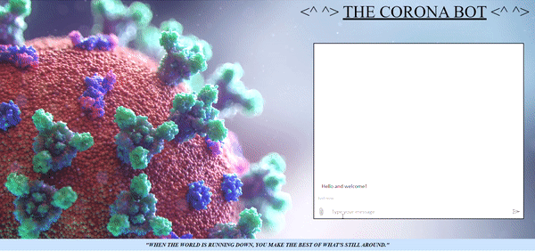

# THE CORONA BOT :

As we know that because of Coronavirus/Covid-19 the world is going through a lot and a lot of question are arising in the minds of people on what is it and how to deal with it in order to be safe with this deadly virus so, this bot help/aware people about the virus and guide them throughout their journey with the bot about the virus.

## Tools / Services used :

- Microsoft Azure Services such as :
  - Cognitive Services (QnA Maker)
  - Azure Bot Services
  - App Services
  - Static Web Apps

- HTML
- CSS

## Description / Features :

- This bot guide people about the do's and don'ts of the virus.
- It understands words and then give the prefered answer to the user.
- It has great responsiveness as it gives solution to the given question in seconds.

## Visuals / Usage / Status :

## Video URL :

https://drive.google.com/file/d/1dk3hket_UeDDkDplXE3FEkbiee0XcgMa/view?usp=sharing

## Roadmap :

As the bot function very smoothly I am planning to add voice to my bot if possible in the near future.

## Support :

If you have an issue regarding this project or you want help anything regarding this project kindly mail me on this id (21sakshichauhan@gmail.com).

## Author :

Ms.Sakshi Chauhan

